# Flowcharts - IRIS Ransomware.live Module

## 📊 System Overview

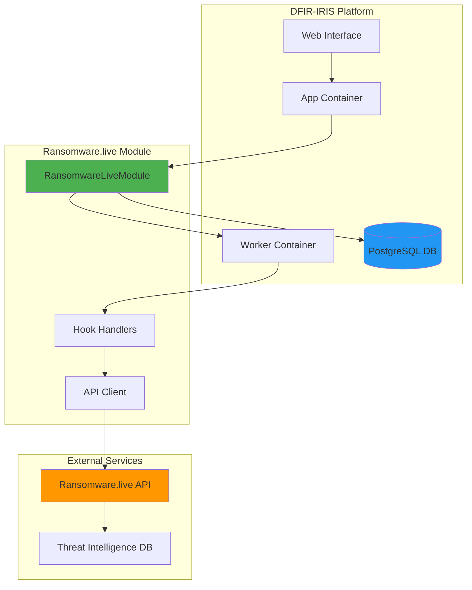

---

## 🔄 Complete Enrichment Flow

```mermaid
flowchart TD
    START([Start]) --> TRIGGER{Trigger Type}
    
    TRIGGER -->|Manual| MANUAL[User clicks<br/>Processors Button]
    TRIGGER -->|Automatic| AUTO[Case created/updated<br/>with ransomware_group]
    
    MANUAL --> EXTRACT
    AUTO --> CHECK_AUTO{Auto-enrich<br/>enabled?}
    
    CHECK_AUTO -->|No| END1([End - No action])
    CHECK_AUTO -->|Yes| EXTRACT
    
    EXTRACT[Extract ransomware_group<br/>from custom_attribute]
    
    EXTRACT --> HAS_GROUP{Group<br/>found?}
    
    HAS_GROUP -->|No - Manual| ERROR1[Return error:<br/>Field empty]
    HAS_GROUP -->|No - Auto| END2([End - Ignored])
    HAS_GROUP -->|Yes| NORMALIZE
    
    ERROR1 --> END3([End])
    
    NORMALIZE[Normalize group name<br/>Ex: Cl0p → Clop]
    
    NORMALIZE --> INIT_SESSION[Initialize HTTP session<br/>+ API Key if available]
    
    INIT_SESSION --> FETCH_PROFILE
    
    subgraph "Fetch Intelligence"
        FETCH_PROFILE[GET /groups/group]
        FETCH_PROFILE --> PROFILE_OK{Status 200?}
        
        PROFILE_OK -->|Yes| CREATE_NOTE1[Create note:<br/>Group Profile]
        PROFILE_OK -->|404| LOG1[Log: Group not found]
        PROFILE_OK -->|Error| LOG2[Log: API error]
        
        CREATE_NOTE1 --> FETCH_IOCS
        LOG1 --> FETCH_IOCS
        LOG2 --> FETCH_IOCS
        
        FETCH_IOCS[GET /iocs/group]
        FETCH_IOCS --> IOCS_OK{Status 200?}
        
        IOCS_OK -->|Yes| CREATE_NOTE2[Create note: IOCs]
        IOCS_OK -->|404/Error| FETCH_NOTES
        
        CREATE_NOTE2 --> ADD_IOCS[Add IOCs to IOC tab<br/>147+ indicators]
        ADD_IOCS --> FETCH_NOTES
        
        FETCH_NOTES[GET /ransomnotes/group]
        FETCH_NOTES --> NOTES_OK{Status 200?}
        
        NOTES_OK -->|Yes| CREATE_NOTE3[Create note:<br/>Ransom Notes]
        NOTES_OK -->|404/Error| FETCH_YARA
        
        CREATE_NOTE3 --> FETCH_YARA
        
        FETCH_YARA[GET /yara/group]
        FETCH_YARA --> YARA_OK{Status 200?}
        
        YARA_OK -->|Yes| CREATE_NOTE4[Create note:<br/>YARA Rules]
        YARA_OK -->|404/Error| CALCULATE
        
        CREATE_NOTE4 --> CALCULATE
    end
    
    CALCULATE[Calculate success:<br/>X/4 endpoints]
    
    CALCULATE --> SUCCESS{Any<br/>success?}
    
    SUCCESS -->|Yes| RETURN_SUCCESS[Return I2Success<br/>with message]
    SUCCESS -->|No| RETURN_ERROR[Return I2Success<br/>with warnings]
    
    RETURN_SUCCESS --> LOG_FINAL[Log: Enrichment complete]
    RETURN_ERROR --> LOG_FINAL
    
    LOG_FINAL --> END([End])
    
    style START fill:#4CAF50
    style END fill:#4CAF50
    style END1 fill:#9E9E9E
    style END2 fill:#9E9E9E
    style END3 fill:#F44336
    style CREATE_NOTE1 fill:#2196F3
    style CREATE_NOTE2 fill:#2196F3
    style CREATE_NOTE3 fill:#2196F3
    style CREATE_NOTE4 fill:#2196F3
    style ADD_IOCS fill:#FF9800
```

---

## 🎯 Ransomware Group Extraction Detail

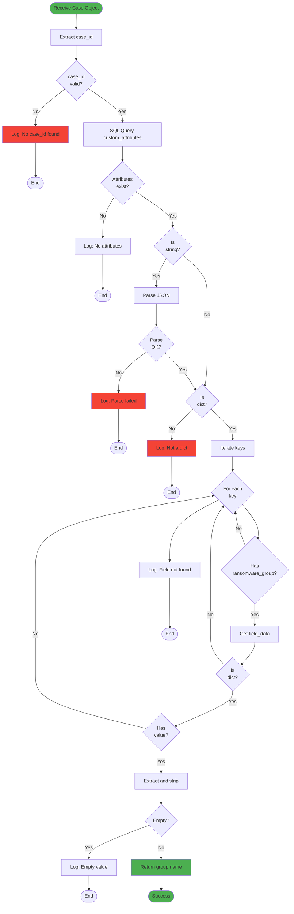

---

## 📝 Note Creation Detail

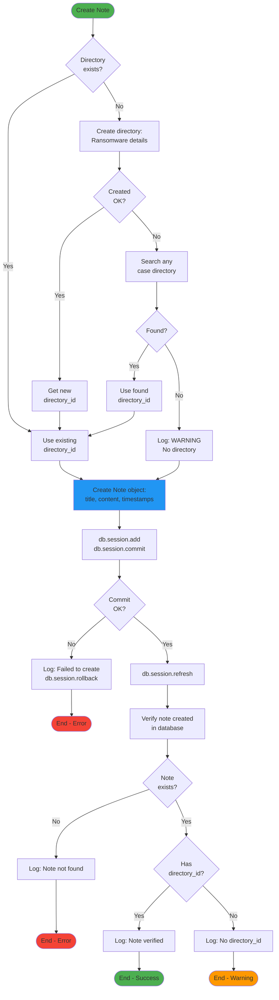

---

## 🔍 IOC Addition to Case Detail

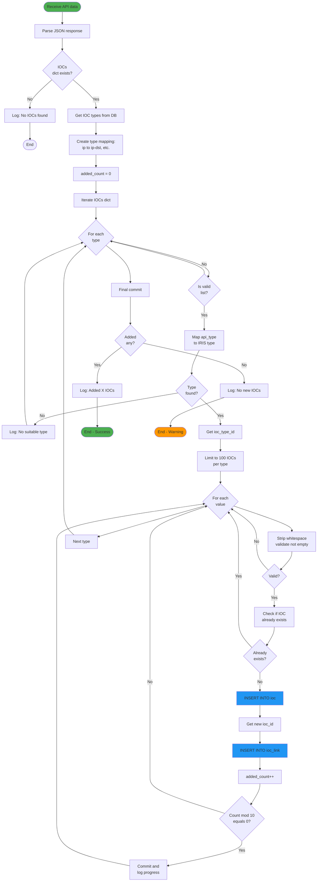

---

## 🌐 Ransomware.live API Interaction

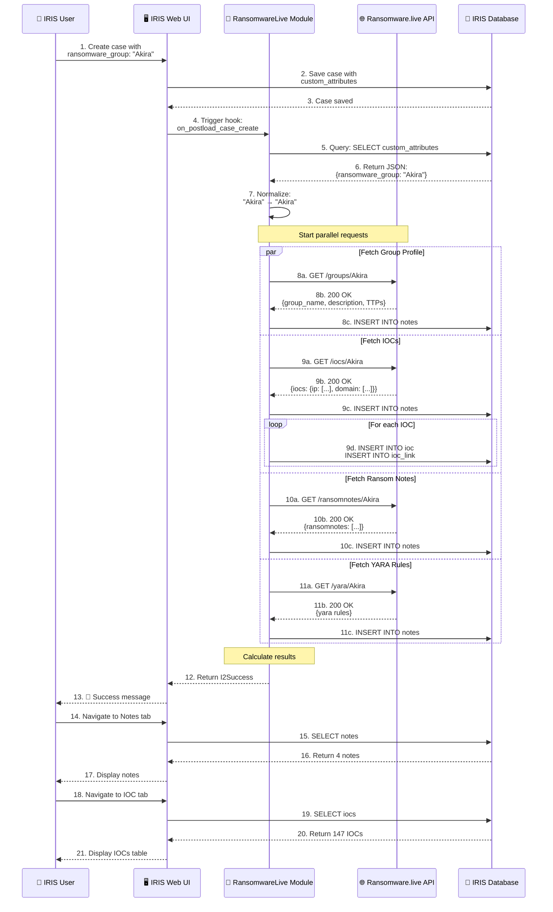

---

## ⚙️ System Hooks and Triggers

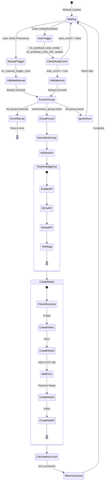

---

## 📊 Data Structure

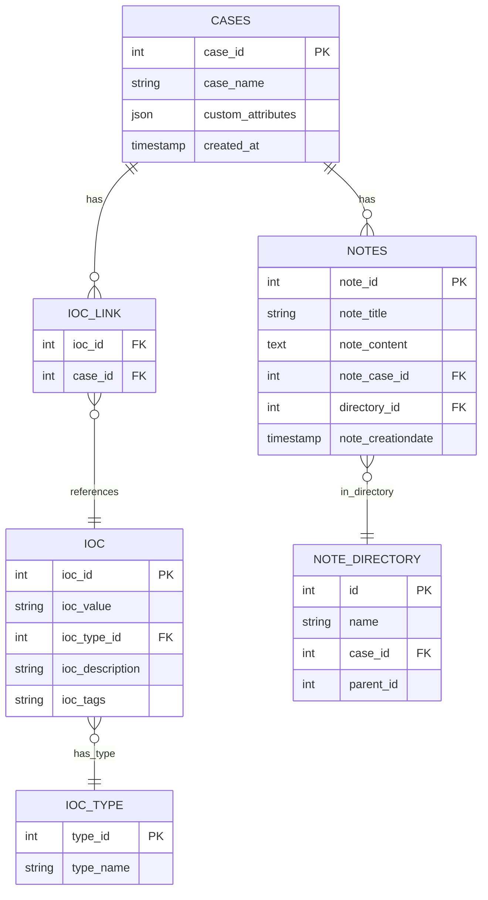

---

## 🎨 Component Architecture

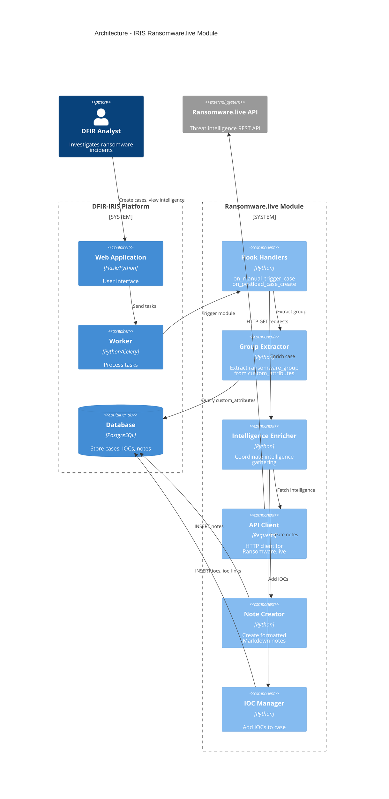

---

## 📈 Complete Data Flow

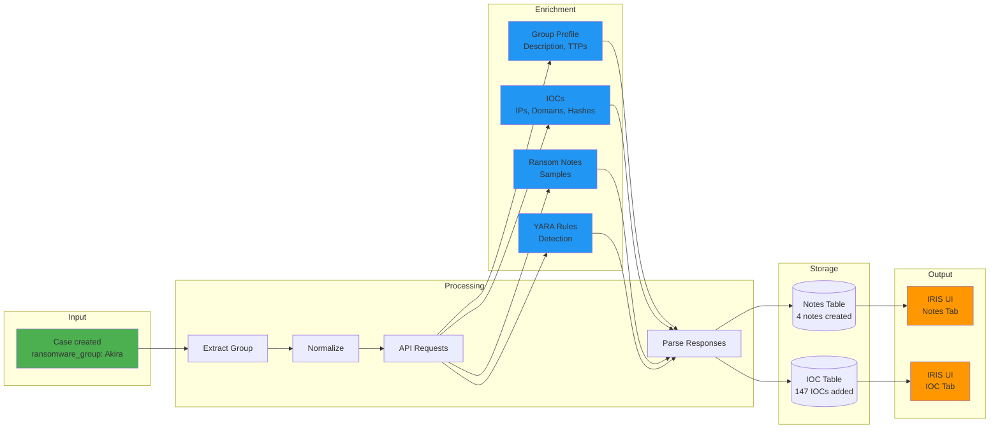

---

## 🔐 API Key Authentication Flow

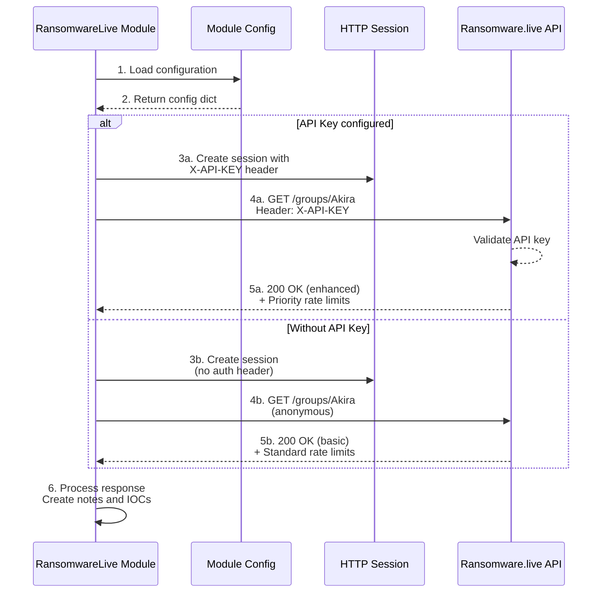
