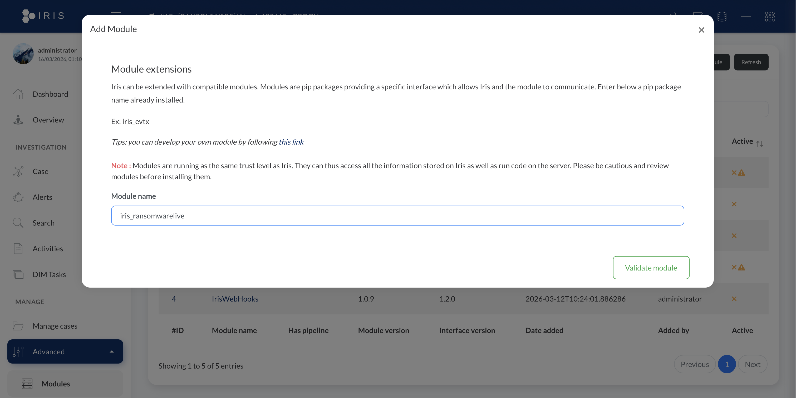
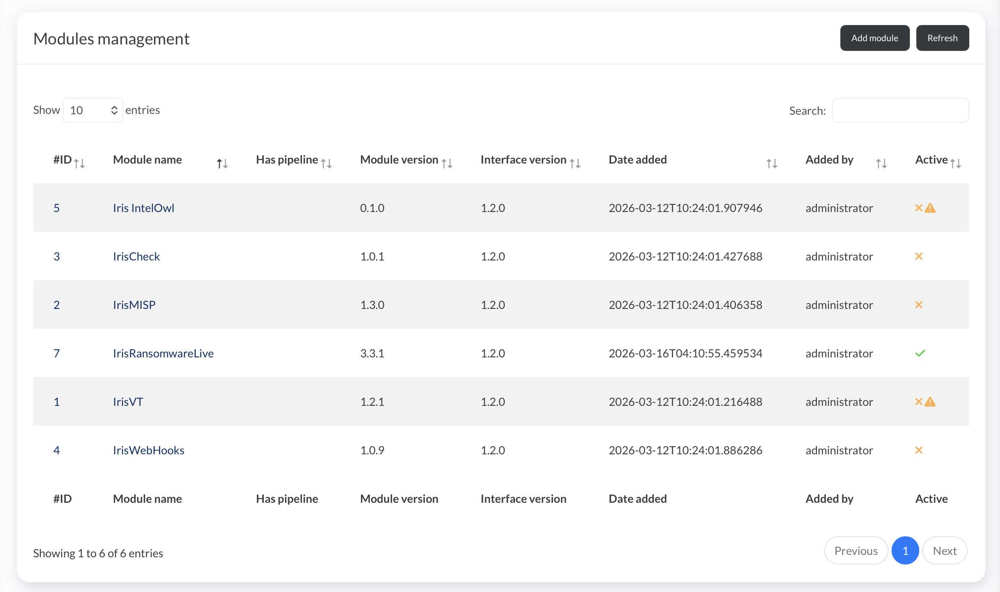
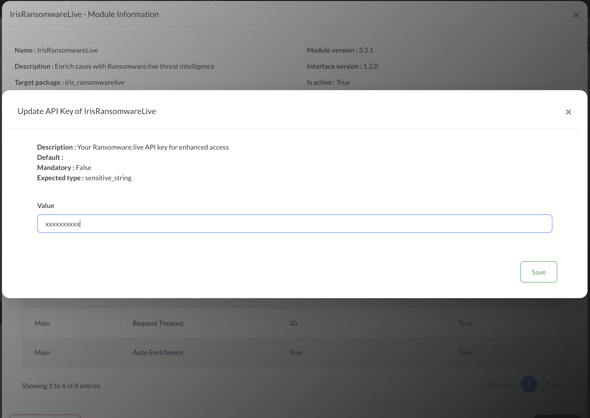
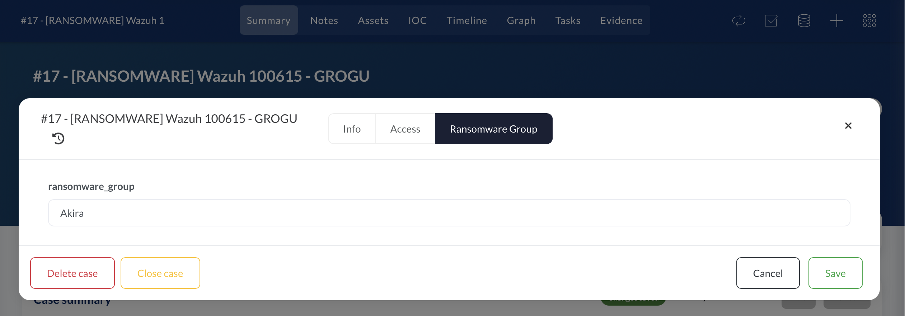
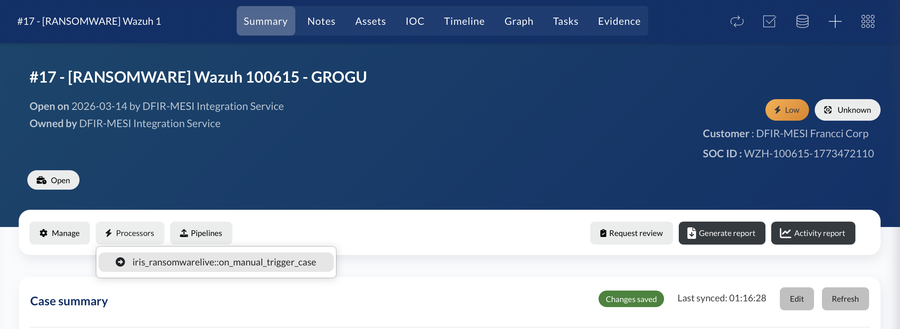
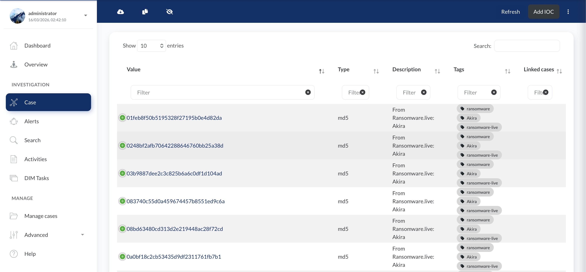
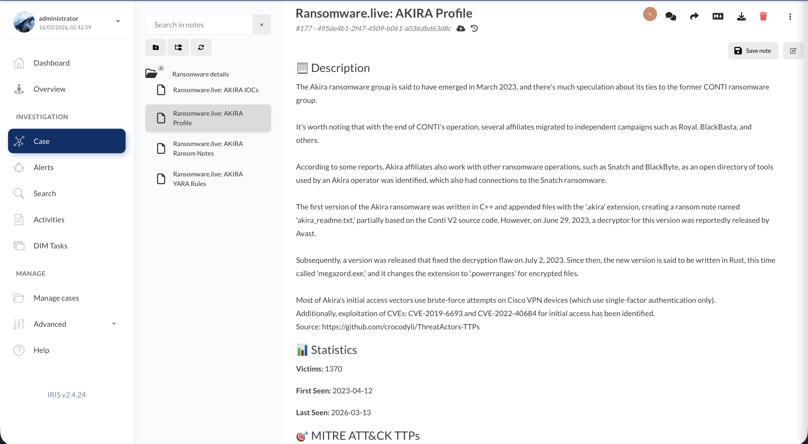

# IrisRansomwareLive

> DFIR-IRIS module for automatic case enrichment with [Ransomware.live](https://ransomware.live) threat intelligence.

[](https://github.com/SEU-USUARIO/iris-ransomwarelive)
[](https://docs.dfir-iris.org)
[](https://www.python.org)
[](LICENSE)

---

## Overview

**IrisRansomwareLive** enriches DFIR-IRIS cases with real-time ransomware threat intelligence sourced from [Ransomware.live](https://ransomware.live). When triggered — automatically on case creation or manually on demand — the module fetches and registers in the case:

- 📋 **Group profile** — description, TTPs, statistics (victims, first/last seen)
- 🔑 **IOCs** — MD5/SHA256 hashes tagged `ransomware-live`
- 📝 **Ransom notes** — sample ransom note content
- 🛡️ **YARA rules** — detection rules for the ransomware family
- 📊 **Custom attributes** — `ransomware_group` field populated in the Case Summary

---

## Requirements

| Requirement | Version |
|---|---|
| DFIR-IRIS | 2.4.x |
| Python (inside `iriswebapp_worker`) | 3.10+ |
| Ransomware.live API | Public (free) or Pro |

---

## Installation

### 1. Install the pip package inside the IRIS worker container

```bash
docker exec iriswebapp_worker \
  /opt/venv/bin/pip install iris_ransomwarelive
```

### 2. Register the module in IRIS

Navigate to **Advanced → Modules → Add Module** and enter:

```
iris_ransomwarelive
```

Click **Validate module**.



After validation, **IrisRansomwareLive v3.3.1** will appear in the modules list with a green active indicator:



### 3. Configure the module (optional)

Click the module name → **Module Information**. Available settings:

| Parameter | Default | Description |
|---|---|---|
| `API URL` | `https://api.ransomware.live` | Ransomware.live API endpoint |
| `API Key` | *(empty)* | Pro API key for enhanced rate limits |
| `Request Timeout` | `30` | HTTP timeout in seconds |
| `Auto Enrichment` | `True` | Enrich automatically on case creation |

To set a Pro API key, click the **API Key** field:



> **Note:** The API key is optional. The public API works without authentication, but has lower rate limits.

---

## Usage

### Setting up a case for enrichment

The module reads the `ransomware_group` custom attribute to identify the ransomware family to query. Set it via **Summary → Manage → Ransomware Group**:



### Manual trigger

With the group name set, click **Processors → `iris_ransomwarelive::on_manual_trigger_case`**:



### Results: IOCs enriched

After enrichment, the case IOC tab is populated with hashes from Ransomware.live, all tagged with `ransomware`, the group name, and `ransomware-live`:



### Results: Group profile note

A note titled **Ransomware.live: \<GROUP\> Profile** is created under the **Ransomware details** directory, containing the group description, statistics, and MITRE ATT&CK TTPs:



The **Ransomware details** note directory also contains:
- `Ransomware.live: <GROUP> IOCs`
- `Ransomware.live: <GROUP> Ransom Notes`
- `Ransomware.live: <GROUP> YARA Rules`

---

## Automatic enrichment

When `Auto Enrichment` is enabled (default), the module is triggered automatically whenever a new case is created — no manual intervention required. The `ransomware_group` field must be populated at case creation time (e.g. by the `custom-iris.py` Wazuh integration script).

---

## Troubleshooting

**Module doesn't appear after validation:**
```bash
# Restart the worker container
cd /opt/dfir-mesi/iris-web && docker compose restart worker
```

**Enrichment returns no data:**
```bash
# Check worker logs (filter for RansomwareLive output)
docker logs iriswebapp_worker --tail 50 | grep '\[RL\]'
```

**Verify the installed package version:**
```bash
docker exec iriswebapp_worker \
  /opt/venv/bin/pip show iris_ransomwarelive
```

**API rate limit errors:**
- Obtain a Pro API key from [Ransomware.live](https://ransomware.live) and configure it in the module settings (see [Configuration](#3-configure-the-module-optional)).

---

## Post-installation checklist

After completing the steps above, verify:

```
═══════════════════════════════════════════════════════
              Installation Completed!                   
═══════════════════════════════════════════════════════

Next steps:

1. Open IRIS web interface
   https://your-iris-server

2. Navigate to modules
   Advanced → Modules → Add Module → and type: iris_ransomwarelive

3. Configure the module (optional)
   • API URL: https://api-pro.ransomware.live
   • Timeout: 30 seconds

To test the module:

1. Create a new case with ransomware_group custom field
   (Summary → Manage → Ransomware Group)

2. Add an IOC of type 'ransomware-group' with value:
   lockbit

3. Click: Processors → iris_ransomwarelive::on_manual_trigger_case

Troubleshooting:

• Check module logs:
  docker logs iriswebapp_worker --tail 50 | grep '[RL]'

• Verify module status:
  docker exec iriswebapp_worker /opt/venv/bin/pip show iris_ransomwarelive

• If module doesn't appear, restart worker:
  cd /opt/dfir-mesi/iris-web && docker compose restart worker
```

---

## License

MIT — see [LICENSE](LICENSE) for details.