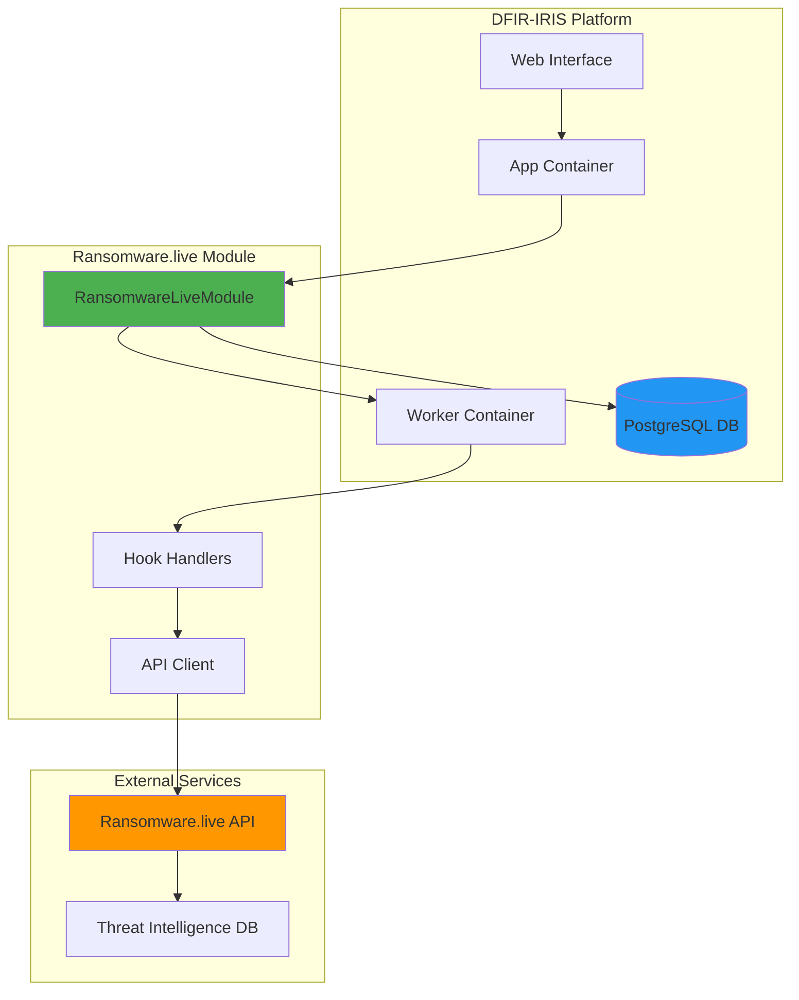
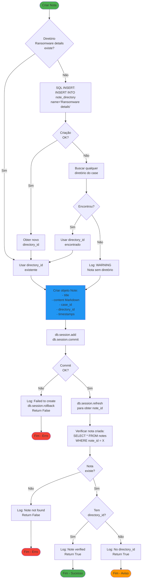
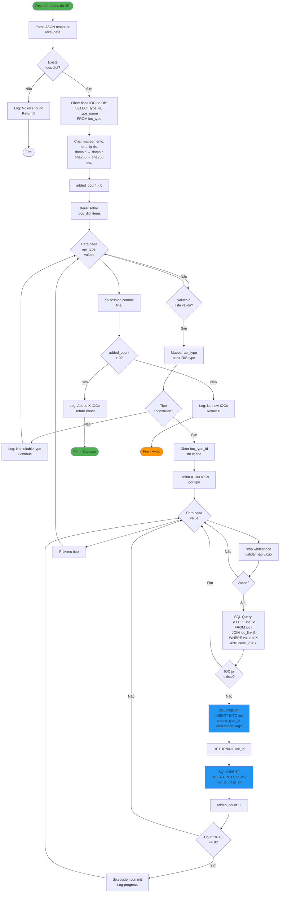
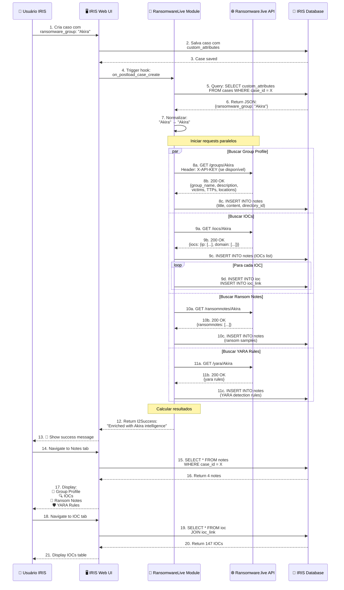
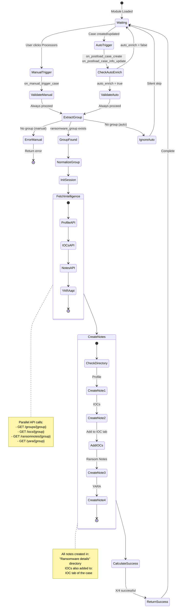
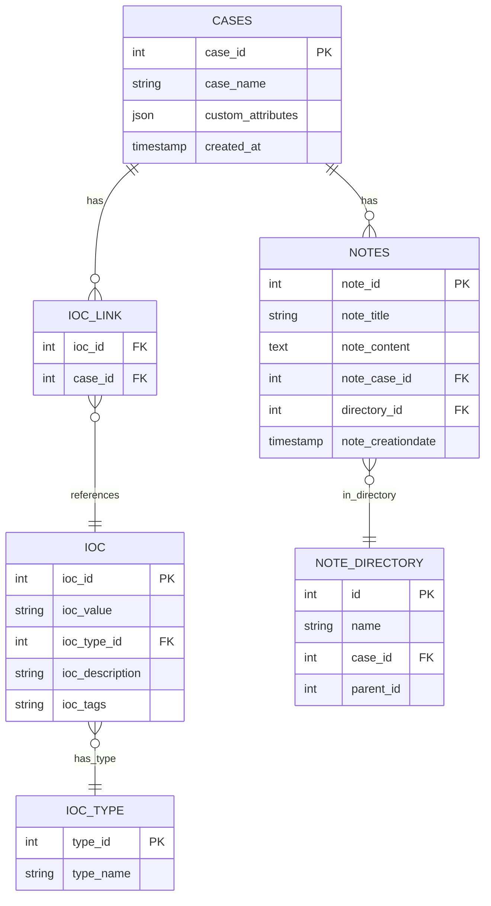
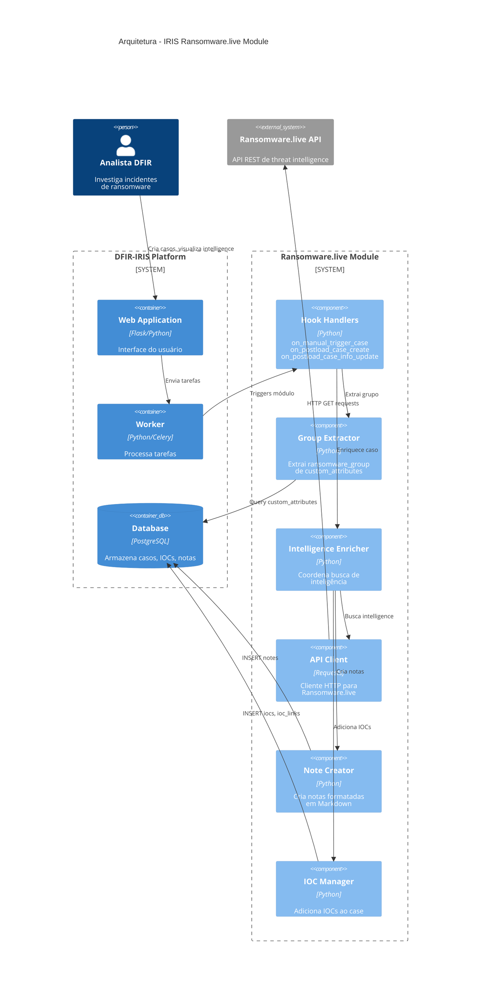
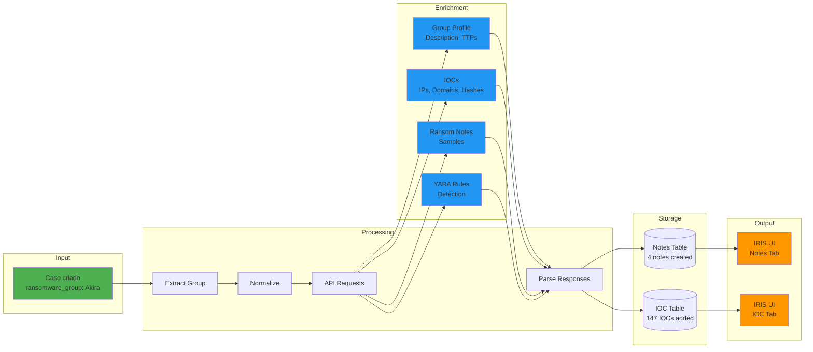
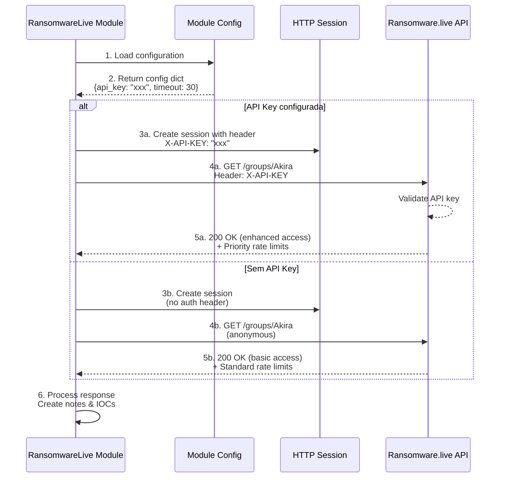

# Fluxogramas - IRIS Ransomware.live Module

## 📊 Visão Geral do Sistema



---

## 🔄 Fluxo Completo de Enriquecimento

```mermaid
flowchart TD
    START([Início]) --> TRIGGER{Tipo de Trigger}
    
    TRIGGER -->|Manual| MANUAL[Usuário clica em<br/>Processors Button]
    TRIGGER -->|Automático| AUTO[Case criado/atualizado<br/>com ransomware_group]
    
    MANUAL --> EXTRACT
    AUTO --> CHECK_AUTO{Auto-enrich<br/>habilitado?}
    
    CHECK_AUTO -->|Não| END1([Fim - Sem ação])
    CHECK_AUTO -->|Sim| EXTRACT
    
    EXTRACT[Extrair ransomware_group<br/>do custom_attribute]
    
    EXTRACT --> HAS_GROUP{Grupo<br/>encontrado?}
    
    HAS_GROUP -->|Não - Manual| ERROR1[Retorna erro:<br/>Campo vazio]
    HAS_GROUP -->|Não - Auto| END2([Fim - Ignorado])
    HAS_GROUP -->|Sim| NORMALIZE
    
    ERROR1 --> END3([Fim])
    
    NORMALIZE[Normalizar nome do grupo<br/>Ex: Cl0p → Clop]
    
    NORMALIZE --> INIT_SESSION[Inicializar sessão HTTP<br/>+ API Key se disponível]
    
    INIT_SESSION --> FETCH_PROFILE
    
    subgraph "Buscar Inteligência"
        FETCH_PROFILE[GET /groups/grupo]
        FETCH_PROFILE --> PROFILE_OK{Status 200?}
        
        PROFILE_OK -->|Sim| CREATE_NOTE1[Criar nota:<br/>Group Profile]
        PROFILE_OK -->|404| LOG1[Log: Grupo não encontrado]
        PROFILE_OK -->|Erro| LOG2[Log: Erro API]
        
        CREATE_NOTE1 --> FETCH_IOCS
        LOG1 --> FETCH_IOCS
        LOG2 --> FETCH_IOCS
        
        FETCH_IOCS[GET /iocs/grupo]
        FETCH_IOCS --> IOCS_OK{Status 200?}
        
        IOCS_OK -->|Sim| CREATE_NOTE2[Criar nota: IOCs]
        IOCS_OK -->|404/Erro| FETCH_NOTES
        
        CREATE_NOTE2 --> ADD_IOCS[Adicionar IOCs à aba IOC<br/>147+ indicadores]
        ADD_IOCS --> FETCH_NOTES
        
        FETCH_NOTES[GET /ransomnotes/grupo]
        FETCH_NOTES --> NOTES_OK{Status 200?}
        
        NOTES_OK -->|Sim| CREATE_NOTE3[Criar nota:<br/>Ransom Notes]
        NOTES_OK -->|404/Erro| FETCH_YARA
        
        CREATE_NOTE3 --> FETCH_YARA
        
        FETCH_YARA[GET /yara/grupo]
        FETCH_YARA --> YARA_OK{Status 200?}
        
        YARA_OK -->|Sim| CREATE_NOTE4[Criar nota:<br/>YARA Rules]
        YARA_OK -->|404/Erro| CALCULATE
        
        CREATE_NOTE4 --> CALCULATE
    end
    
    CALCULATE[Calcular sucesso:<br/>X/4 endpoints]
    
    CALCULATE --> SUCCESS{Algum<br/>sucesso?}
    
    SUCCESS -->|Sim| RETURN_SUCCESS[Retornar I2Success<br/>com mensagem]
    SUCCESS -->|Não| RETURN_ERROR[Retornar I2Success<br/>com avisos]
    
    RETURN_SUCCESS --> LOG_FINAL[Log: Enrichment complete]
    RETURN_ERROR --> LOG_FINAL
    
    LOG_FINAL --> END([Fim])
    
    style START fill:#4CAF50
    style END fill:#4CAF50
    style END1 fill:#9E9E9E
    style END2 fill:#9E9E9E
    style END3 fill:#F44336
    style CREATE_NOTE1 fill:#2196F3
    style CREATE_NOTE2 fill:#2196F3
    style CREATE_NOTE3 fill:#2196F3
    style CREATE_NOTE4 fill:#2196F3
    style ADD_IOCS fill:#FF9800
```



---

## 🎯 Detalhamento: Extração do Grupo Ransomware

```mermaid
flowchart TD
    START([Receber Case Object]) --> GET_ID[Extrair case_id]
    
    GET_ID --> HAS_ID{case_id<br/>válido?}
    
    HAS_ID -->|Não| ERROR1[Log: No case_id found<br/>Return None]
    HAS_ID -->|Sim| QUERY_DB
    
    ERROR1 --> END1([Fim])
    
    QUERY_DB[SQL Query:<br/>SELECT custom_attributes<br/>FROM cases<br/>WHERE case_id = X]
    
    QUERY_DB --> HAS_ATTRS{custom_attributes<br/>existe?}
    
    HAS_ATTRS -->|Não| LOG1[Log: No custom_attributes<br/>Return None]
    HAS_ATTRS -->|Sim| CHECK_TYPE
    
    LOG1 --> END2([Fim])
    
    CHECK_TYPE{Tipo é<br/>string?}
    
    CHECK_TYPE -->|Sim| PARSE_JSON[json.loads<br/>custom_attributes]
    CHECK_TYPE -->|Não| CHECK_DICT
    
    PARSE_JSON --> PARSE_OK{Parse<br/>OK?}
    
    PARSE_OK -->|Não| ERROR2[Log: Failed to parse JSON<br/>Return None]
    PARSE_OK -->|Sim| CHECK_DICT
    
    ERROR2 --> END3([Fim])
    
    CHECK_DICT{É um<br/>dict?}
    
    CHECK_DICT -->|Não| ERROR3[Log: Not a dict<br/>Return None]
    CHECK_DICT -->|Sim| ITERATE
    
    ERROR3 --> END4([Fim])
    
    ITERATE[Iterar sobre keys<br/>do dict]
    
    ITERATE --> LOOP{Para cada<br/>group_name,<br/>group_data}
    
    LOOP --> HAS_FIELD{Existe<br/>ransomware_group<br/>em group_data?}
    
    HAS_FIELD -->|Não| LOOP
    HAS_FIELD -->|Sim| GET_VALUE
    
    GET_VALUE[field_data =<br/>group_data['ransomware_group']]
    
    GET_VALUE --> IS_DICT{field_data<br/>é dict?}
    
    IS_DICT -->|Não| LOOP
    IS_DICT -->|Sim| HAS_VALUE
    
    HAS_VALUE{Existe<br/>'value'?}
    
    HAS_VALUE -->|Não| LOOP
    HAS_VALUE -->|Sim| EXTRACT
    
    EXTRACT[group = field_data['value']<br/>strip whitespace]
    
    EXTRACT --> IS_EMPTY{group<br/>vazio?}
    
    IS_EMPTY -->|Sim| LOG2[Log: Empty value<br/>Return None]
    IS_EMPTY -->|Não| SUCCESS
    
    LOG2 --> END5([Fim])
    
    SUCCESS[Log: Group found: Akira<br/>Return group]
    
    SUCCESS --> END6([Fim - Sucesso])
    
    LOOP --> NOT_FOUND[Log: Field not found<br/>Return None]
    NOT_FOUND --> END7([Fim])
    
    style START fill:#4CAF50
    style END6 fill:#4CAF50
    style SUCCESS fill:#4CAF50
    style ERROR1 fill:#F44336
    style ERROR2 fill:#F44336
    style ERROR3 fill:#F44336
```

---

## 📝 Detalhamento: Criação de Notas



---

## 🔍 Detalhamento: Adição de IOCs ao Case



---

## 🌐 Interação com Ransomware.live API



---

## ⚙️ Hooks e Triggers do Sistema



---

## 📊 Estrutura de Dados



---

## 🎨 Arquitetura de Componentes



---

## 📈 Fluxo de Dados Completo



---

## 🔐 Fluxo de Autenticação com API Key



